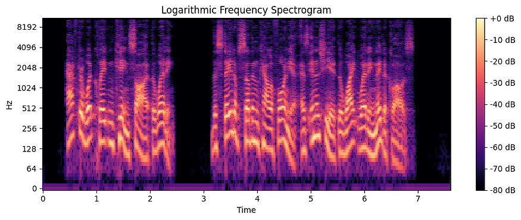
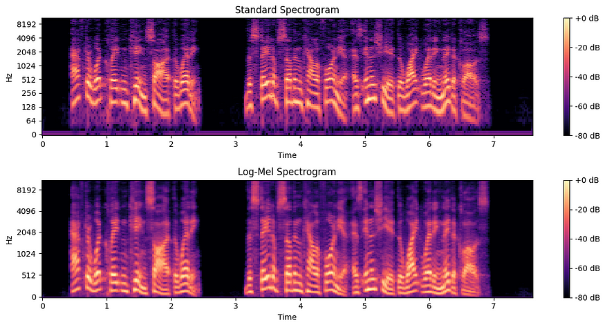
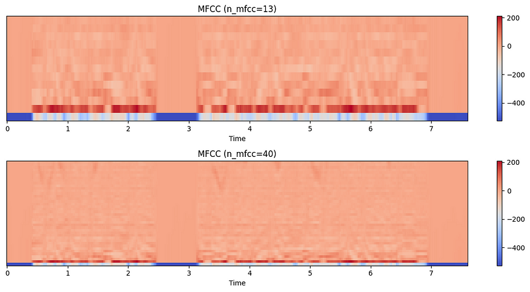
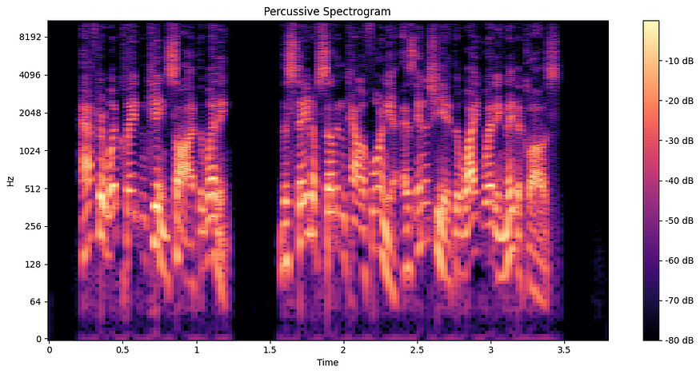

# INTRODUCTION:
Have you ever wondered how Siri recognizes the words you say? Or how Spotify knows the genre of a song without it being mentioned anywhere?
<BR>
All this is possible thanks to Audio Analysis :)
<BR>
This document will examine some important aspects of audio analysis and the tools used to do the same.
<BR>

<BR>

# Introduction to Audio Analysis
Audio analysis is the process of processing audio signals to extract vital information, enabling a wide range of applications, from music genre classification to speech recognition, from environmental sound identification to emotion detection in voice.
<BR>

In this case, by leveraging robust Python libraries like Librosa, we can efficiently process and analyze audio data, transforming raw sound into actionable information.
<BR>

# Setting up the Environment
To start using Librosa, you can use the following pip command to install librosa in your current Python environment.
```console
pip install librosa
```

# Librosa Basics
Let's take a quick look at some of the most important features of Librosa that make it so useful for various audio analysis tasks.

    - Time and frequency domain conversions
    - Spectral features
    - Tempo and beat tracking
    - Visualization tools

To learn more, refer to the [official Librosa documentation](https://librosa.org/doc/latest/index.html)

# Loading and Visualizing Audio
Let's get straight to the point, shall we?<BR>
How do you load an audio file using librosa?                                                                                <BR>
```python
 audio_path = 'your_audio_file.wav'
 y, sr = librosa.load(audio_path)
```

 Here 'y' represents the audio time series data which are 1D numpy arrays. It contains the amplitude values of the audio signal.<BR>
 Each element corresponds to a sample of the audio waveform.

 'sr' represents the sampling rate for the audio file.                                                               <BR>
 The sampling rate indicates how many samples per second are contained in the audio file.

# Feature Extraction
Let's take a look at some feature extractions using Librosa.

Plotting a simple waveform should be a good starting point
```python
import librosa 
import matplotlib.pyplot as plt 

# Load the audio file
 y, sr = librosa.load('/content/morgan-freeman-convert-file.wav') 

# Plot the waveform with customization
 plt.figure(figsize=(16, 6)) 
 librosa.display.waveshow(y, sr=sr, max_points=10000, axis='time', color='green') 
 plt.title('Customized Waveform') 
 plt.xlabel('Time (seconds)') 
 plt.ylabel('Amplitude') 
 plt.grid(True) 
 plt.show()
```


<BR>

# Amplitude Envelope and Onset Detection
The amplitude envelope helps us derive the overall volume of the entire audio file, while onset detection refers to transients and the beginning of a new "Sound Peak".

```python
# Compute STFT
 audio_path = 'insert_your_audio_file_here.wav'
 y, sr = librosa.load(audio_path) 

 stft = librosa.stft(y) 

# Find the maximum amplitude among frequencies for each time interval
 amplitude_envelope = np.max(np.abs(stft), axis=0) 

 plt.figure(figsize=(12, 6)) 

# Plot the waveform
 plt.subplot(3, 1, 1) 
 librosa.display.waveshow(y, sr=sr, alpha=0.5) 
 plt.title('Waveform') 

# Plot the peak amplitude envelope
 plt.subplot(3, 1, 2) 
 plt.plot(librosa.frames_to_time(np.arange(len(amplitude_envelope)), sr=sr), amplitude_envelope, label='Peak Amplitude') 
 plt.xlabel('Time (s)') 
 plt.ylabel('Amplitude') 
 plt.title('Peak Amplitude Envelope') 
 plt.legend() 

# Plot the onset times as vertical lines
 plt.subplot(3, 1, 3) 
 librosa.display.waveshow(y, sr=sr, alpha=0.5) 
 plt.vlines(onset_time, -1, 1, color='g', linestyle='dashed', label='Onsets') 
 plt.legend() 
 plt.title('Onset Detection') 

 plt.tight_layout() 
 plt.show()
```


# Fourier Transform
Imagine a complex sound, like a symphony orchestra. It is a mix of various instruments playing different notes at different volumes. The Fourier Transform (FT) is a mathematical tool that breaks down this complex sound into its individual frequency components.
In simpler terms, it takes a signal (like sound) in the time domain (how it changes over time) and converts it into the frequency domain (what frequencies are present and their intensities).

```python
import librosa 
import librosa.display 
import matplotlib.pyplot as plt 
import numpy as np 

# Load a sample audio file
 y, sr = librosa.load("insert_your_audio_file_here.wav") 

# Compute the Short-Time Fourier Transform (STFT)
 D = librosa.stft(y) 

# Convert the STFT to magnitude values
 S = np.abs(D) 

# Plot the spectrogram
 plt.figure(figsize=(10, 4)) 
 librosa.display.specshow(librosa.amplitude_to_db(S, ref=np.max), sr=sr, x_axis='time', y_axis='log') 
 plt.colorbar(format='%+2.0f dB') 
 plt.title('Spectrogram') 
 plt.tight_layout() 
 plt.show()
```

A spectrogram is a visual representation of the frequency spectrum of a signal as it varies with time. It is like a snapshot of the sound, showing which frequencies are present at different points in time.


##### **Time axis**: horizontal axis representing time.<BR> **Frequency axis**: vertical axis representing frequency. <BR>**Amplitude/intensity**: the color or brightness of each point indicates the strength of the frequency at that time.

**Human hearing is logarithmic.** This means we perceive loudness on a logarithmic scale rather than a linear one. Converting to a logarithmic scale compresses loud sounds and amplifies quieter ones, better matching human perception. Here are some modifications to the above spectrogram using the amplitude-to-dB conversion function.

```python
# Plot the spectrogram with a logarithmic scale
 plt.figure(figsize=(10, 4)) 
 librosa.display.specshow(librosa.amplitude_to_db(S, ref=np.max), sr=sr, x_axis='time', y_axis='log') 
 plt.colorbar(format='%+2.0f dB') 
 plt.title('Logarithmic Frequency Spectrogram') 
 plt.tight_layout() 
 plt.show()
```


## Comparison


# MFCC
Imagine you have a collection of different voices. How can you distinguish them? You might focus on certain characteristics like pitch, tone, and rhythm. MFCCs (Mel-Frequency Cepstral Coefficients) do something similar for computers.

They break down a sound into smaller pieces and then focus on the parts that are important for human hearing. Imagine describing a face based on the shape of the eyes, nose, and mouth. MFCCs create a kind of "fingerprint" of the sound, making it easier for computers to recognize and differentiate different sounds.

```python
import librosa 
import librosa.display 
import matplotlib.pyplot as plt 
import numpy as np 
from google.colab import file 

# Load the custom WAV file

 y, sr = librosa.load("insert_audio_here.wav") 

# Compute MFCC with different n_mfcc values
 mfccs_13 = librosa.feature.mfcc(y=y, sr=sr, n_mfcc=13) 
 mfccs_40 = librosa.feature.mfcc(y=y, sr=sr, n_mfcc=40) 

# Plot MFCC with n_mfcc=13
 plt.figure(figsize=(12, 6)) 
 plt.subplot(2, 1, 1) 
 librosa.display.specshow(mfccs_13, sr=sr, x_axis='time') 
 plt.colorbar() 
 plt.title('MFCC (n_mfcc=13)') 

# Plot MFCC with n_mfcc=40
 plt.subplot(2, 1, 2) 
 librosa.display.specshow(mfccs_40, sr=sr, x_axis='time') 
 plt.colorbar() 
 plt.title('MFCC (n_mfcc=40)') 

 plt.tight_layout() 
 plt.show()
```

**Note**: The n_mfcc parameter determines how many coefficients are computed for each frame of the audio signal. By default, n_mfcc=13, which means 13 coefficients per frame. Increasing n_mfcc results in more coefficients being computed and displayed on the y-axis of the MFCC plot.



**Detail and Resolution**:
Lower n_mfcc values (e.g., 13): typically capture the most essential characteristics of the audio signal. The first coefficients generally represent the overall shape of the spectral envelope, which is often sufficient for many speech and audio recognition tasks. Higher n_mfcc values (e.g., 40): provide more detailed information about the spectral envelope. This can be useful for more detailed audio analysis but may also include more noise or irrelevant information.

# Chromagrams
Chromagrams are snapshots of musical harmony over time.

Think of them as a color-coded map of a song, where each color represents a musical note. Brighter colors indicate that the note is played louder. This makes them useful for understanding chord progressions and the overall harmony of a musical piece.

Chromagrams find direct application in music identification systems, automatic transcription of musical pieces, and music recommendation.

Let's see how we can plot some in librosa.

```python
import librosa 
import librosa.display 
import matplotlib.pyplot as plt 
import numpy as np 
from google.colab import file 

 y, sr = librosa.load("your_audio_here.wav") 

# Compute the Short-Time Fourier Transform (STFT) with a high number of FFT points for better frequency resolution
 D = librosa.stft(y, n_fft=4096) 

# Convert the STFT to magnitude values
 S = np.abs(D) 

# Convert to dB
 S_db = librosa.amplitude_to_db(S, ref=np.max) 

# Plot the spectrogram with high-frequency resolution
 plt.figure(figsize=(12, 6)) 
 librosa.display.specshow(S_db, sr=sr, x_axis='time', y_axis='log') 
 plt.colorbar(format='%+2.0f dB') 
 plt.title('High-Frequency Resolution Spectrogram') 
 plt.tight_layout() 
 plt.show() 

# Harmonic-Percussive Source Separation (HPSS)
 harmonic, percussive = librosa.effects.hpss(y) 

# Compute and plot the harmonic spectrogram
 D_harmonic = librosa.stft(harmonic, n_fft=4096) 
 S_harmonic = np.abs(D_harmonic) 
 S_harmonic_db = librosa.amplitude_to_db(S_harmonic, ref=np.max) 

 plt.figure(figsize=(12, 6)) 
 librosa.display.specshow(S_harmonic_db, sr=sr, x_axis='time', y_axis='log') 
 plt.colorbar(format='%+2.0f dB') 
 plt.title('Harmonic Spectrogram') 
 plt.tight_layout() 
 plt.show() 

# Compute and plot the percussive spectrogram
 D_percussive = librosa.stft(percussive, n_fft=4096) 
 S_percussive = np.abs(D_percussive) 
 S_percussive_db = librosa.amplitude_to_db(S_percussive, ref=np.max) 

 plt.figure(figsize=(12, 6)) 
 librosa.display.specshow(S_percussive_db, sr=sr, x_axis='time', y_axis='log') 
 plt.colorbar(format='%+2.0f dB') 
 plt.title('Percussive Spectrogram')
 plt.tight_layout() 
 plt.show() 

# Compute and plot the chromagram 
chromagram = librosa.feature.chroma_stft(y=y, sr=sr, n_fft=4096, n_chroma=24) 

 plt.figure(figsize=(12, 6)) 
 librosa.display.specshow(chromagram, sr=sr, x_axis='time', y_axis='chroma') 
 plt.colorbar() 
 plt.title('Chromagram') 
 plt.tight_layout() 
 plt.show()
```

**Harmonic Spectrogram**: A harmonic spectrogram focuses on the harmonic components of an audio signal. It is usually derived from a standard spectrogram by isolating the peaks corresponding to harmonic partials. This representation is useful for analyzing tonal sounds and music.


**Percussive Spectrogram**: A percussive spectrogram emphasizes the transient and percussive elements of an audio signal. It is often obtained by subtracting the harmonic spectrogram from the original spectrogram. This representation is useful for studying rhythmic patterns and percussion instruments.



# Conclusion
In summary, we have learned about audio analysis using Librosa and its utility in feature extraction and visualization.
