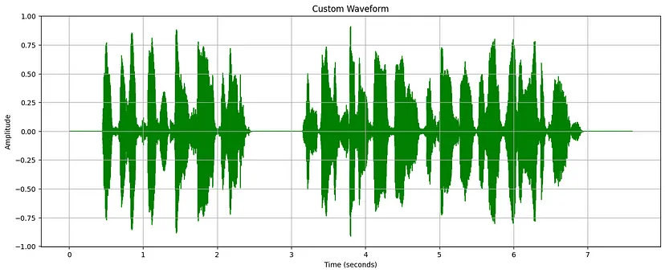
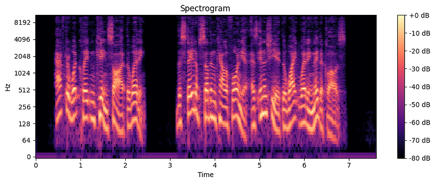
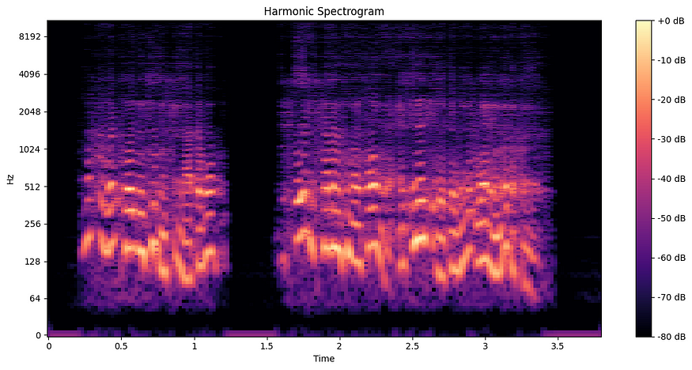

# INTRODUZIONE:
Vi siete mai chiesti come fa Siri a riconoscere le parole che dici? O il fatto che Spotify sappia di che genere è una canzone 
senza che venga menzionato da nessuna parte.
<BR>
Tutto questo è possibile grazie all'Analisi Audio :)
<BR>
In questo documento verranno esaminati alcuni aspetti importanti dell'analisi audio e degli strumenti utilizzati per fare lo 
stesso.
<BR>

<BR>

# Introduzione all'analisi audio
L'analisi audio è il processo di elaborazione dei segnali audio per estrarre informazioni vitali, consentendo un'ampia gamma di 
applicazioni, dalla classificazione dei generi musicali al riconoscimento vocale, dall'identificazione dei suoni ambientali al 
rilevamento delle emozioni nella voce.
<BR>

In questo caso, sfruttando le solide librerie di Python come Librosa, possiamo elaborare e analizzare in modo efficiente i dati
audio, trasformando il suono grezzo in informazioni fruibili.
<BR>

# Impostazione dell'ambiente
Per iniziare a usare Librosa puoi usare il seguente comando pip per installare librosa nel tuo attuale ambiente Python.
```console
pip install librosa
```

# Nozioni di base di Librosa
Diamo un'occhiata veloce ad alcune delle caratteristiche più importanti di Librosa che lo rendono così utile per varie attività 
di analisi audio.

    - Conversioni nel dominio del tempo e della frequenza
    - Caratteristiche spettrali
    - Monitoraggio del tempo e del beat
    - Strumenti di visualizzazione

Per saperne di più consulta la [documentazione ufficiale di Librosa](https://librosa.org/doc/latest/index.html)

# Caricamento e visualizzazione audio
Andiamo subito al dunque, va bene?<BR>
Come si carica un file audio utilizzando librosa?                                                                                <BR>
```python
 audio_path = 'your_audio_file.wav'
 y, sr = librosa.load (audio_path)
```

 Qui 'y' rappresenta i dati della serie temporale audio che sono array numpy 1D. Contiene i valori di ampiezza del segnale audio.<BR>
 Ogni elemento corrisponde a un campione della forma d'onda audio

 'sr' rappresenta la frequenza di campionamento per il file audio.                                                               <BR>
 La frequenza di campionamento indica quanti campioni al secondo sono contenuti nel file audio.

# Estrazione delle caratteristiche
Diamo un'occhiata ad alcune estrazioni di funzionalità utilizzando Librosa.

Tracciare un semplice grafico a onde dovrebbe essere un buon punto di partenza
```python
import librosa 
import matplotlib.pyplot as plt 

# Carica il file audio
 y, sr = librosa.load( '/content/morgan-freeman-convert-file.wav' ) 

# Traccia la forma d'onda con personalizzazione
 plt.figure(figsize=( 16 , 6 )) 
 librosa.display.waveshow(y, sr=sr, max_points= 10000 , axis= 'time' , color= 'green' ) 
 plt.title( 'Forma d'onda personalizzata' ) 
 plt.xlabel( 'Tempo (secondi)' ) 
 plt.ylabel( 'Ampiezza' ) 
 plt.grid( True ) 
 plt.show()
```


<BR>

# Rilevamento dell'inviluppo dell'ampiezza e dell'inizio
L'ampiezza dell'inviluppo ci aiuta a ricavare il volume generale dell'intero file audio, mentre il rilevamento dell'inizio si riferisce ai transienti e all'inizio di un nuovo "Picco sonoro".

```python
# Calcola STFT
 audio_path = 'insert_your_audio_file_here.wav'
 y, sr = librosa.load(audio_path) 

 stft = librosa.stft(y) 

# Trova l'ampiezza massima tra le frequenze per ogni intervallo di tempo
 amplitude_envelope = np. max (np. abs (stft), axis= 0 ) 

 plt.figure(figsize=( 12 , 6 )) 

# Traccia la forma d'onda
 plt.subplot( 3 , 1 , 1 ) 
 librosa.display.waveshow(y, sr=sr, alpha= 0.5 ) 
 plt.title( 'Forma d'onda' ) 

# Traccia l'inviluppo dell'ampiezza di picco
 plt.subplot( 3 , 1 , 2 ) 
 plt.plot(librosa.frames_to_time(np.arange( len (amplitude_envelope)), sr=sr), amplitude_envelope, label= 'Ampiezza massima' ) 
 plt.xlabel( 'Tempo (s)' ) 
 plt.ylabel( 'Ampiezza' ) 
 plt.title( 'Inviluppo dell'ampiezza di picco' ) 
 plt.legend() 

# Traccia i tempi di inizio come linee verticali
 plt.subplot( 3 , 1 , 3 ) 
 librosa.display.waveshow(y, sr=sr, alpha= 0.5 ) 
 plt.vlines(onset_time, - 1 , 1 , color= 'g' , linestyle= 'dashed' , label= 'Inizi' ) 
 plt.legend() 
 plt.title( 'Rilevamento inizio' ) 

 plt.tight_layout() 
 plt.show()
```


# Trasformata di Fourier
Immagina un suono complesso, come un'orchestra sinfonica. È un mix di vari strumenti che suonano note diverse a volumi diversi. 
La trasformata di Fourier (FT) è uno strumento matematico che scompone questo suono complesso nei suoi singoli componenti di frequenza.
In termini più semplici, prende un segnale (come il suono) nel dominio del tempo (come cambia nel tempo) e lo converte nel dominio della frequenza (quali frequenze sono presenti e le loro intensità).

```python
import librosa 
import librosa.display 
import matplotlib.pyplot as plt 
import numpy as np 

# Carica un file audio di esempio
 y, sr = librosa.load( "insert_your_audio_file_here.wav" ) 

# Calcola la trasformata di Fourier a breve termine (STFT)
 D = librosa.stft(y) 

# Converti la STFT a valori complessi in magnitudine
 S = np. abs (D) 

# Traccia lo spettrogramma
 plt.figure(figsize=( 10 , 4 )) 
 librosa.display.specshow(librosa.amplitude_to_db(S, ref=np. max ), sr=sr, x_axis= 'time' , y_axis= 'log' ) 
 plt.colorbar( format = '%+2.0f dB' ) 
 plt.title( 'Spettrogramma' ) 
 plt.tight_layout() 
 plt.show()
```

Uno spettrogramma è una rappresentazione visiva dello spettro di frequenze di un segnale mentre cambia nel tempo. È come un'istantanea del suono, che mostra quali frequenze sono presenti in diversi punti nel tempo.


##### **Asse del tempo**: asse orizzontale che rappresenta il tempo.<BR> **Asse della frequenza**: asse verticale che rappresenta la frequenza. <BR>**Ampiezza/intensità**: il colore o la luminosità di ogni punto indica la forza della frequenza in quel momento.

**L'udito umano è logaritmico.** Ciò significa che percepiamo la sonorità su una scala logaritmica anziché lineare. La conversione in scala logaritmica comprime i suoni forti e amplifica quelli più deboli, adattandosi meglio alla percezione umana. Ecco alcune modifiche allo spettrogramma di cui sopra che utilizzano la funzione di conversione dell'ampiezza in dB.

```python
# Traccia lo spettrogramma con scala logaritmica
 plt.figure(figsize=( 10 , 4 )) 
 librosa.display.specshow(librosa.amplitude_to_db(S, ref =np.max), sr=sr, x_axis= 'time' , y_axis= 'log' ) 
 plt.colorbar( format = '%+2.0f dB' ) 
 plt.title( 'Spettrogramma di frequenza logaritmica' ) 
 plt.tight_layout() 
 plt.show()
```


## Confronto


# MFCC
Immagina di avere una raccolta di voci diverse. Come puoi distinguerle? Potresti concentrarti su alcune caratteristiche come altezza, tono e ritmo. Gli MFCC (Mel-Frequency Cepstral Coefficients) fanno qualcosa di simile per i computer.

Scompongono un suono in pezzi più piccoli e poi si concentrano sulle parti che sono importanti per l'udito umano. Immagina di descrivere un volto in base alla forma di occhi, naso e bocca. Gli MFCC creano una specie di "impronta digitale" del suono, rendendo più facile per i computer riconoscere e differenziare suoni diversi.

```python
import librosa 
import librosa.display 
import matplotlib.pyplot as plt 
import numpy as np 
from google.colab import file 

# Carica il file WAV personalizzato

 y, sr = librosa.load( "insert_audio_here.wav" ) 

# Calcola MFCC con diversi valori n_mfcc
 mfccs_13 = librosa.feature.mfcc(y=y, sr=sr, n_mfcc= 13 ) 
 mfccs_40 = librosa.feature.mfcc(y=y, sr=sr, n_mfcc= 40 ) 

# Traccia gli MFCC con n_mfcc=13
 plt.figure(figsize=( 12 , 6 )) 
 plt.subplot( 2 , 1 , 1 ) 
 librosa.display.specshow(mfccs_13, sr=sr, x_axis= 'tempo' ) 
 plt.colorbar() 
 plt.title( 'MFCC (n_mfcc=13)' ) 

# Traccia gli MFCC con n_mfcc=40
 plt.subplot( 2 , 1 , 2 ) 
 librosa.display.specshow(mfccs_40, sr=sr, x_axis= 'tempo' ) 
 plt.colorbar() 
 plt.title( 'MFCC (n_mfcc=40)' ) 

 plt.tight_layout() 
 plt.show()
```

**Nota**: il parametro n_mfcc determina quanti coefficienti vengono calcolati per ogni frame del segnale audio. Per impostazione predefinita, n_mfcc=13, che significa 13 coefficienti per frame. Aumentando n_mfcc si ottengono più coefficienti calcolati e visualizzati sull'asse y del grafico MFCC.


**Dettaglio e risoluzione** :
Valori n_mfcc più bassi (ad esempio, 13): in genere catturano le caratteristiche più essenziali del segnale audio. I primi coefficienti rappresentano generalmente la forma complessiva dell'involucro spettrale, che è spesso sufficiente per molte attività di riconoscimento vocale e audio. Valori n_mfcc più alti (ad esempio, 40): forniscono informazioni più dettagliate sull'involucro spettrale. Ciò può essere utile per un'analisi audio più dettagliata, ma può anche includere più rumore o informazioni irrilevanti.

# Cromagrammi
I cromatogrammi sono istantanee dell'armonia musicale nel tempo.

Pensateli come una mappa codificata a colori di una canzone, dove ogni colore rappresenta una nota musicale. I colori più brillanti indicano che la nota è suonata più forte. Ciò li rende utili per comprendere le progressioni degli accordi e l'armonia complessiva di un brano musicale.

I cromatogrammi trovano applicazione diretta nei sistemi di identificazione musicale, trascrizione automatica di brani musicali e raccomandazione musicale.

Vediamo come possiamo tracciarne alcuni in librosa.

```python
import librosa 
import librosa.display 
import matplotlib.pyplot as plt 
import numpy as np 
from google.colab import file 

 y, sr = librosa.load( "your_audio_here.wav" ) 

# Calcola la trasformata di Fourier a breve termine (STFT) con un numero elevato di punti FFT per una migliore risoluzione di frequenza
 D = librosa.stft(y, n_fft= 4096 ) 

# Converti la STFT a valori complessi in magnitudine
 S = np. abs (D) 

# Converti in dB
 S_db = librosa.amplitude_to_db(S, ref=np. max ) 

# Traccia lo spettrogramma con risoluzione ad alta frequenza
 plt.figure(figsize=( 12 , 6 )) 
 librosa.display.specshow(S_db, sr=sr, x_axis= 'time' , y_axis= 'log' ) 
 plt.colorbar( format = '%+2.0f dB' ) 
 plt.title( 'Spettrogramma con risoluzione ad alta frequenza' ) 
 plt.tight_layout() 
 plt.show() 

# Separazione armonica-percussiva della sorgente (HPSS)
 harmonic, percussive = librosa.effects.hpss(y) 

# Calcola e traccia lo spettrogramma armonico
 D_harmonic = librosa.stft(harmonic, n_fft= 4096 ) 
 S_harmonic = np. abs (D_armonica) 
 S_armonica_db = librosa.amplitude_to_db(S_armonica, ref=np. max ) 

 plt.figure(figsize=( 12 , 6 )) 
 librosa.display.specshow(S_armonica_db, sr=sr, x_axis= 'time' , y_axis= 'log' ) 
 plt.colorbar( format = '%+2.0f dB' ) 
 plt.title( 'Spettrogramma armonico' ) 
 plt.tight_layout() 
 plt.show() 

# Calcola e traccia lo spettrogramma percussivo
 D_percussive = librosa.stft(percussive, n_fft= 4096 ) 
 S_percussive = np. abs (D_percussive) 
 S_percussive_db = librosa.amplitude_to_db(S_percussive, ref=np. max ) 

 plt.figure(figsize=( 12 , 6 )) 
 librosa.display.specshow(S_percussive_db, sr=sr, x_axis= 'time' , y_axis= 'log' ) 
 plt.colorbar( format = '%+2.0f dB' ) 
 plt.title( 'Spettrogramma percussivo' )
 plt.tight_layout() 
 plt.show() 

# Calcola e traccia il cromagramma 
cromagramma = librosa.feature.chroma_stft(y=y, sr=sr, n_fft= 4096 ,n_chroma= 24 ) 

 plt.figure(figsize=( 12 , 6 )) 
 librosa.display.specshow(cromagramma, sr=sr, x_axis= 'time' , y_axis= 'chroma' ) 
 plt.colorbar() 
 plt.title( 'Cromagramma' ) 
 plt.tight_layout() 
 plt.show()
```

**Spettrogramma delle armoniche** : uno spettrogramma armonico si concentra sulle componenti armoniche di un segnale audio. Di solito è derivato da uno spettrogramma standard isolando i picchi corrispondenti alle parziali armoniche. Questa rappresentazione è utile per analizzare i suoni tonali e la musica.



**Spettrogramma percussivo** : uno spettrogramma percussivo enfatizza gli elementi transitori e percussivi di un segnale audio. Spesso si ottiene sottraendo lo spettrogramma armonico dallo spettrogramma originale. Questa rappresentazione è utile per studiare i pattern ritmici e gli strumenti a percussione.


# Conclusione
Riassumendo, abbiamo imparato a conoscere l'analisi audio utilizzando Librosa e la sua utilità nell'estrazione e nella visualizzazione delle caratteristiche.