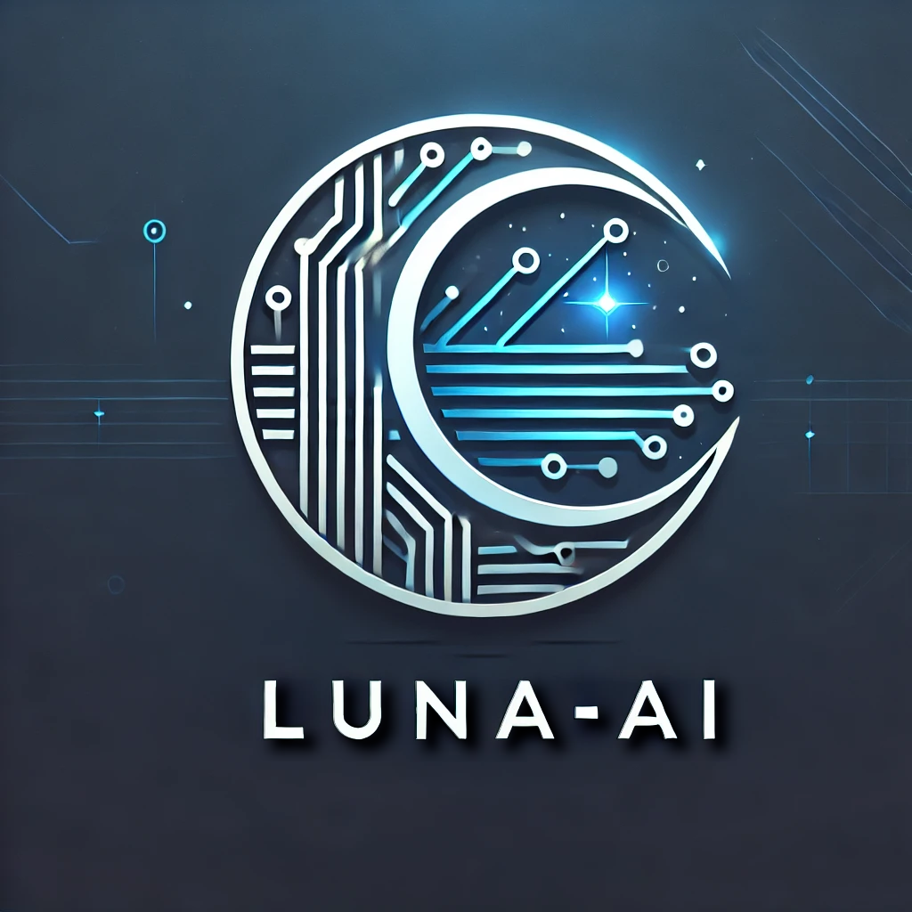

<!-- # 

 -->
<svg fill="none" viewBox="0 0 600 300" width="600" height="300" xmlns="http://www.w3.org/2000/svg">
  <foreignObject width="100%" height="100%">
    

      
      

          

          

          

              <H1>
L.U.N.A. - AI
</H1>
          

          
    
              
(L)inked (U)nified (N)eural (A)rchitecture - Artificial Intelligence

          

                 
          
      
              <B>Descrizione del Progetto:</B> 
              LUNA-AI rappresenta un'architettura neurale universale progettata per affrontare una vasta gamma di applicazioni di intelligenza artificiale. La sua natura scalabile e modulare consente di adattarsi a molteplici contesti, come:
              <UL>
                  <LI>
                      Assistenza Virtuale: Supporto agli utenti in tempo reale con capacità di riconoscimento vocale, comprensione contestuale, e risposte personalizzate.
                  </LI>
                  <LI>
                      Apprendimento Adattivo: Capacità di apprendere dinamicamente da nuove informazioni per migliorare l’efficacia nel tempo.
                  </LI>
                  <LI>
                      Multimodalità: Integrazione di dati vocali, testuali, visivi e di sensori per fornire un’esperienza completa e avanzata.
                  </LI>
                  <LI>
                      Accessibilità Universale: Un’architettura progettata per essere leggera, facilmente implementabile e disponibile per dispositivi con risorse limitate.
                  </LI>
                  <LI>
                      Mission: Creare un sistema di intelligenza artificiale capace di adattarsi e rispondere a qualsiasi esigenza, sfruttando un'architettura neurale "universale" che abbatta i confini tra le diverse applicazioni dell'IA.
                  </LI>
              </UL>
          

           
          

              <B>Overview:</B> 
              LUNA-AI è un assistente virtuale complesso composto da diversi moduli, organizzati in engine (Senses) e livelli di elaborazione o ragionamento (Layers) basati su processi separati, per simulare il più possibile il funzionamento cerebrale umano e implementando elaborazioni multilivello che integrano aspetti cognitivi, emotivi, logici e istintivi. La progettazione modulare consente una parallelizzazione efficiente e una gestione asincrona di tali operazioni.
          

      

      
    

  </foreignObject>
</svg>

# Architettura del Progetto "Luna"

## 1. Engines di Basso Livello (Hardware/Fisico)

 Questi sono i componenti fondamentali che permettono a Luna di funzionare. Rappresentano la "fisicità" dell'intelligenza artificiale, che include:

 - LLM Engine (Large Language Model): Questo è il cuore di Luna, il modello linguistico che gestisce la comprensione e la generazione del linguaggio naturale.
 
 - NLP (Natural Language Processing): Rappresenta la parte che si occupa di comprendere il linguaggio umano, analizzando strutture grammaticali, semantiche e contesti.
 
 - Computer Vision: Se Luna dovrà interagire visivamente, avrai bisogno di un modulo di visione artificiale che riconosce immagini, volti e oggetti. Potrebbe anche essere usato per riconoscere emozioni tramite il viso.
 
 - RAG (Retrieval Augmented Generation): Sistemi di ricerca che combinano capacità di recupero di dati (database, documenti) e generazione per fornire risposte ancora più accurate e contestuali.
 
 - TTS (Text to Speech): La parte che consente a Luna di "parlare" con l'utente, trasformando le risposte in suono.
 
 - STT (Speech to Text): Trasforma l'audio in testo, permettendo a Luna di "ascoltare" e comprendere gli input vocali.
 
 - Voice-to-Voice: Se desideri che Luna parli con un altro assistente o entità, avrai bisogno di un sistema che converte voce in testo e viceversa per una comunicazione bidirezionale in tempo reale.

 Questi componenti di basso livello creano la base fisica su cui gli altri livelli più complessi possono costruire sopra.

## 2. Strato dell'Inconscio
  Questo livello simulerà un tipo di "reazione automatica", simile a un istinto, che guida Luna in situazioni in cui la razionalità non è completamente necessaria. Può includere:

 - Heuristiche di risposta automatica: Luna può rispondere in modo rapido e automatico a comandi ripetitivi o predefiniti.
 
 - Bias comportamentali: Luna può sviluppare preferenze o tendenze a rispondere in certi modi in base all’esperienza.

 Questo strato non deve essere "consapevole", ma semplicemente reattivo e programmato per rispondere velocemente a situazioni comuni.

## 3. Strato dell'Emotività e dell'Empatia
 Simula le emozioni e la capacità di comprendere quelle altrui. Si basa su un sistema che riconosce segnali emotivi nelle conversazioni e reagisce di conseguenza.

 - Analisi del tono di voce: Usare il STT per rilevare variazioni nel tono e nel ritmo della voce dell’utente per dedurre l'emozione.
 
 - Linguaggio empatico: Luna dovrebbe essere in grado di rispondere con una certa empatia, cercando di rispecchiare lo stato emotivo dell'utente, magari scegliendo di usare un linguaggio confortante in caso di tristezza o entusiasmo in caso di gioia.
 
 - Modeling emozionale: Utilizzo di modelli psicologici per determinare possibili emozioni, come tristezza, felicità, frustrazione, ecc.

## 4. Strato della Memoria Soggettiva
 Questo livello sarà simile alla memoria a lungo termine di un individuo, dove Luna memorizza informazioni importanti che si basano sulle interazioni passate e le esperienze.

 - Memorizzazione contestuale: Luna può "ricordare" cosa ha detto l'utente in precedenti conversazioni o contesti. E.g., "Ti piace il gelato alla fragola".
 - Memoria personalizzata: Memorizza preferenze, abitudini, storie, e persino esperienze emotive per offrire risposte più contestualizzate.
 - Aggiornamento dinamico: Luna dovrebbe essere in grado di aggiornare questa memoria sulla base di nuovi input, cambiamenti nelle preferenze o esperienze.
 
 
## 5. Strato del Ragionamento Logico
 Questo strato è dedicato alla parte "razionale" di Luna, che elabora e analizza i dati per prendere decisioni logiche e risolvere problemi complessi.

 - Ragionamento deduttivo e induttivo: Luna potrebbe avere la capacità di trarre conclusioni in modo logico, utilizzando la deduzione (partire da principi generali per arrivare a conclusioni specifiche) o l'induzione (analizzare esempi concreti per arrivare a una regola generale).
 
 - Piani d'azione: Utilizzare un sistema di pianificazione automatica per risolvere compiti complessi in modo efficiente.
 
 - Ragionamento causale: Identificare le cause di certi fenomeni o comportamenti.

## 6. Strato Cognitivo
 Questo è il livello più "intelligente" e profondo, in cui Luna può usare la sua memoria, le sue emozioni, e il ragionamento logico per prendere decisioni e rispondere in maniera più intelligente.

 - Capacità di apprendimento: Luna può migliorare nel tempo, apprendendo da nuove esperienze, feedback e modificando il proprio comportamento.
 
 - Auto-riflessione: Luna può "riflettere" sulle sue risposte e interazioni, per migliorarsi in futuro.
 
 - Comprensione contestuale profonda: La combinazione di tutti gli strati permette a Luna di comprendere non solo le parole dell’utente, ma anche il significato profondo dietro le azioni, le emozioni e le situazioni.

# Integrazione dei Layers
 Questi strati lavoreranno insieme in maniera fluida. Ecco come possono interagire:

 - Interazione tra strati: Gli strati di basso livello (come il riconoscimento vocale (ASR), lo la trascrizione del "parlato" (STT), la conversione del testo in audio (TTS) etc...)interagiscono direttamente con gli strati superiori come la memoria e l'emotività. Ad esempio, se Luna riconosce un tono di tristezza, lo strato emotivo lo comunica al sistema, che attiverà risposte più empatiche.
 
 - Memoria dinamica: Lo strato della memoria aggiornerà costantemente il suo contenuto in base alle risposte di Luna, creando un sistema che si evolve nel tempo.

 - Ragionamento contestuale: Quando Luna affronta un problema complesso, lo strato del ragionamento logico interviene, mentre il layer emotivo può determinare la modalità di risposta (empatica, razionale, etc.).

# Struttura del Progetto
La struttura delle cartelle del progetto Luna-AI è stata progettata per separare chiaramente i vari engine, layers e i moduli di supporto (helpers). 
Ogni sezione ha uno scopo specifico e ogni file contiene il codice per implementare una funzionalità ben definita. La struttura finale è la seguente:
<PRE>
LUNA-AI/
├── startLuna-AI.py                                       # File principale del progetto
├── requirements.txt                                      # Dipendenze globali
├── README.md                                             # INTRODUZIONE AL PROGETTO (questo file)
│   
├── Documentss/                                           # Directory di progetto contenente la documentazione.
│   ├── PROJECT_SETUP.md                                  # Documentazione di guida al setup del progetto.
│   └── TTS_SETUP.md
│
├── AssetsLibs/                                           # Directory del progetto contenente gli assets di basso livello nececessari.
│   │
│   ├── Abstraction/                                      # Directory del progetto contenente gli assets e le classi Astratte di Luna-AI
│   │   └── Process/                                      # Directory del progetto contenente l'Astrazione di base dei processi di Luna-AI 
│   │       ├── README.md                                 # Documento di introduzione al processBase astratto di Luna-AI
│   │       ├── __init__.py
│   │       └── lib_NeuralProcess.py                      # Processo astratto di base ereditato da tutti i Brain layers e gli engines di basso livello di Luna-AI
│   │
│   ├── AI_Models/                                        # Directory contenitore per i modelli addestrati e moduli specifici
│   │   ├── README.md
│   │   └── __init__.py
│   │
│   ├── Helpers/
│   │   ├── README.md
│   │   ├── __init__.py
│   │   ├── message_queue.py
│   │   ├── async_utils.py
│   │   ├── logger.py
│   │   │
│   │   └── Configuration/
│   │       ├── README.md
│   │       ├── __init__.py
│   │       └── lib_Configuration.py
│   │
├── DevTools/
│   └── __init__.py
│   
├── Documentss/                                       # Directory di progetto contenente la documentazione.
│   ├── PROJECT_SETUP.md                              # Documentazione di guida al setup del progetto.
│   └── TODO_TASKS.md
│
├── MySelf/
│   │
│   ├── Body/
│   │   ├── Arms/
│   │   │   ├── Left/                                 # Contiene i dati di posizionamento 3D e sensoriali (aptici e termici) del braccio sinistro
│   │   │   │   └── ForeArm/                          # Contiene i dati di posizionamento 3D e sensoriali (aptici e termici) dell'avambraccio sinistro
│   │   │   │       └── Hand/                         # Contiene i dati di posizionamento 3D e sensoriali (aptici e termici) della mano sinistra
│   │   │   │
│   │   │   └── Right/                                # Contiene i dati di posizionamento 3D e sensoriali (aptici e termici) del braccio destro
│   │   │       └── ForeArm/                          # Contiene i dati di posizionamento 3D e sensoriali (aptici e termici) dell'avambraccio destro
│   │   │           └── Hand/                         # Contiene i dati di posizionamento 3D e sensoriali (aptici e termici) della mano destro
│   │   │
│   │   ├── Chest/
│   │   │
│   │   ├── Head/
│   │   │   ├── HeadPivot/                            #
│   │   │   ├── LeftEye/                              #
│   │   │   ├── Mouth/                                #
│   │   │   ├── Nose/                                 #
│   │   │   ├── RightEye/                             #
│   │   │   └── Tongue/                               #
│   │   │
│   │   └── Legs/
│   │       ├── Left/                                 #
│   │       │   └── Thigh/                            #
│   │       │       └── Shin/                         #
│   │       │           └── Foot/                     #
│   │       └── Right/                                #
│   │           └── Thigh/                            #
│   │               └── Shin/                         #
│   │                   └── Foot/                     #
│   │
│   ├── Brain/ 
│   │   ├── Knowledge/
│   │   │   ├── AuditoryMem/                          # Contiene i dati uditivi rilevanti per il riconoscimento delle sorgenti sonore e dei timbri vocali
│   │   │   ├── ConceptualMem/                        # Contiene i dati relativi ai nuovi concetti assimilati dall'ultimo training
│   │   │   ├── EmotionalalMem/                       # Contiene i dati relativi ai nuovi stati emozionali assimilati dall'ultimo training
│   │   │   ├── LongTermMem/                          # Contiene i collegamenti relativi a dati ed eventi assimilate nelle sessioni di training precedenti
│   │   │   ├── SelfExperiencesMem/                   # Contiene i collegamenti relativi a dati ed eventi associati ad esperienze passate e assimilate nelle sessioni di training precedenti
│   │   │   ├── ShortTermMem/                         # Contiene i collegamenti relativi a dati ed eventi assimilati dall'ultimo training
│   │   │   └── VisualMem/                            # Contiene i dati visivi di rilevanza per il riconoscimento di volti e oggetti
│   │   │
│   │   └── Layers/
│   │       ├── AutoReflection/
│   │       │   ├── __init__.py
│   │       │   ├── config.yaml
│   │       │   ├── lib_AutoReflectionLayer.py        # Layer delle riflessioni personali e introspettive di Luna-AI
│   │       │   └── README.md                         # Documento di introduzione al layer logico delle riflessioni personali e introspettive di Luna-AI
│   │       │
│   │       ├── Cognitive/
│   │       │   ├── __init__.py
│   │       │   ├── config.yaml
│   │       │   ├── lib_CognitiveLayer.py             # Layer cognitivo di Luna-AI
│   │       │   └── README.md                         # Documento di introduzione al layer logico cognitivo di Luna-AI
│   │       │
│   │       ├── Emotional/
│   │       │   ├── __init__.py
│   │       │   ├── config.yaml
│   │       │   ├── lib_EmotionalLayer.py             # Layer emozionale/empatico di Luna-AI
│   │       │   └── README.md                         # Documento di introduzione al layer emozionale/empatico di Luna-AI
│   │       │
│   │       ├── Imaginary/
│   │       │   ├── __init__.py
│   │       │   ├── config.yaml
│   │       │   ├── lib_ImaginaryLayer.py             # Layer dell'immaginazione di Luna-AI
│   │       │   └── README.md                         # Documento di introduzione al layer dei pensieri immaginari di Luna-AI
│   │       │
│   │       ├── Logical/
│   │       │   ├── __init__.py
│   │       │   ├── config.yaml
│   │       │   ├── lib_LogicalLayer.py               # Layer dei pensieri logici di Luna-AI
│   │       │   └── README.md                         # Documento di introduzione al layer dei pensieri logici di Luna-AI
│   │       │
│   │       ├── Mnemonic/
│   │       │   ├── __init__.py
│   │       │   ├── config.yaml
│   │       │   ├── lib_MnemonicLayer.py              # Layer dei pensieri memonici di Luna-AI
│   │       │   └── README.md                         # Documento di introduzione al layer dei pensieri memonici di Luna-AI
│   │       │
│   │       ├── Subconscious/                         
│   │       │   ├── __init__.py
│   │       │   ├── config.yaml
│   │       │   ├── lib_SubconsciousLayer.py          # Layer dei pensieri inconsci di Luna-AI
│   │       │   └── README.md                         # Documento di introduzione al layer dei pensieri inconsci di Luna-AI
│   │       │
│   │       └── README.md
│   │
│   ├── Senses/
│   │   ├── _ExternalStimuli/
│   │   │   ├── Aptic/
│   │   │   │   ├── __init__.py
│   │   │   │   └── README.md
│   │   │   │
│   │   │   ├── Audible/
│   │   │   │   ├── __init__.py
│   │   │   │   └── README.md
│   │   │   │
│   │   │   ├── Olfactory/
│   │   │   │   ├── __init__.py
│   │   │   │   └── README.md
│   │   │   │
│   │   │   ├── Visive/
│   │   │   │   ├── __init__.py
│   │   │   │   └── README.md
│   │   │   │
│   │   │   └── __init__.py
│   │   │
│   │   ├── HearingSense/
│   │   │   ├── __init__.py
│   │   │   ├── config.yaml
│   │   │   ├── lib_HearingEngine.py
│   │   │   └── README.md
│   │   │
│   │   ├── OlfactorySense/
│   │   │   ├── __init__.py
│   │   │   ├── config.yaml
│   │   │   ├── lib_OlfactoryEngine.py
│   │   │   └── README.md
│   │   │
│   │   ├── SpeechSense/
│   │   │   ├── __init__.py
│   │   │   ├── config.yaml
│   │   │   ├── lib_SpeechEngine.py
│   │   │   └── README.md
│   │   │
│   │   ├── TouchSense/
│   │   │   ├── __init__.py
│   │   │   ├── config.yaml
│   │   │   ├── lib_TouchEngine.py
│   │   │   └── README.md
│   │   │
│   │   └── VisiveSense/
│   │       ├── __init__.py
│   │       ├── config.yaml
│   │       ├── lib_VisionEngine.py
│   │       └── README.md
│   │
│   └── Spine/
│       └── _MovementStimuli/
│           └── __init__.py
│    
└── TestEnv/
    ├── TestMain.py                                       # Punto di ingresso per l'esecuzione dei test
    ├── config_test.yaml                                  # File di configurazione per i test
    │
    ├── Test_HearEngine/                                  # Cartella con i test specifici per Hear_Engine
    │   └── test_hear_engine.py                           # File con i test definiti
    │
    ├── Test_AnotherModule/                               # Altra cartella per test di altri moduli
    │   └── test_another_module.py
    │
    └── TestData/                                         # Cartella con file di test audio o altri dati di test
        └── dummy_audio.wav
</PRE>

# Decisioni strutturali e Motivationi

## 1. Sottocartella AssetsLibs/Abstaction:

 - Descrizione: Ogni classe di astrazione di base è contenuta in una propria sottocartella con un file .py per il codice operativo, e un file README.md che ne descrive la funzione e la configurazione.

 - Motivazione: Gli engine e i brain_layers sono processi che compongono Luna-AI, ognuno dei quali gestisce specifiche funzionalità proprie ma che ereditano da classi astratte definite all'interno della sottocartella 'abstraction'.

## 2. Sottocartella AassetsLibs/Helpers/:

 - Descrizione: Include file Python come message_queue.py, async_utils.py, config_loader.py, e logger.py, che forniscono supporto generico per la gestione dei dati, la configurazione e la logica asincrona.

 - Motivazione: Gli helper sono moduli di supporto che gestiscono funzionalità comuni e utili tra gli engine, come la gestione della coda dei messaggi, l'asincronia, il logging e il caricamento della configurazione.

## 3. Sottocartella AassetsLibs/AI_Modules/:

 - Descrizione: Include file Python come message_queue.py, async_utils.py, config_loader.py, e logger.py, che forniscono supporto generico per la gestione dei dati, la configurazione e la logica asincrona.

 - Motivazione: Gli helper sono moduli di supporto che gestiscono funzionalità comuni e utili tra gli engine, come la gestione della coda dei messaggi, l'asincronia, il logging e il caricamento della configurazione.

## 4. Sottocartella MySelf/Senses/:

 - Descrizione: Ogni classe engine è contenuta in una propria sottocartella con un file .py per il codice operativo, e un file README.md che ne descrive la funzione e la configurazione.

 - Motivazione: Gli engine o sensi sono i "motori" principali che alimentano le capacità di Luna-AI, ognuno dei quali gestisce specifiche funzionalità come LLM (Language Model), NLP, TTS (Text-to-Speech), STT (Speech-to-Text), CV (Computer Vision), RAG (Retrieval-Augmented Generation) e Voice-to-Voice. Ogni engine è separato in una propria cartella per modularità e chiarezza.

## 5. Sottocartella MySelf/Brain/Layers/*/:

 - Descrizione: Ogni layer (come l'inconscio, l'emotività, la memoria soggettiva, il ragionamento logico e cognitivo etc..) è rappresentato da una cartella con un file .py che contiene la logica di quel layer. Ogni layer avrà anche un "README.md" per descriverne il funzionamento e il proprio file di configurazione "config.yaml".

 - Motivazione: I layers di Luna-AI rappresentano vari livelli di elaborazione e simulano i processi cognitivi, emotivi e logici di un'intelligenza artificiale simile alla mente umana. Sono stati separati in layer distinti per permettere una gestione modulare dei vari aspetti dell'AI.

# Funzioni e Compiti dei File

## 1. Engine Files (llm_engine.py, speech_engine.py, ecc.):

 - Descrizione: Ogni file di engine contiene l'implementazione specifica del motore e le funzioni necessarie per eseguire il task relativo (ad esempio, generazione del testo nel caso del LLM, o riconoscimento vocale per STT).

 - Compiti: Ogni engine avrà funzioni per inizializzare l'engine (Init), attivarlo (Activate) e metterlo in uno stato di inattività o sospensione (Sleep), come definito nell'astrazione della classe EngineProcess_base. Ogni engine sarà progettato per lavorare in modo asincrono, permettendo il parallelismo tra i vari motori.

## 2. Brain Layer Files (unconscious_layer.py, emotional_layer.py, ecc.):

 - Descrizione: Ogni file del layer implementa un "strato" del comportamento dell'assistente, simulando una specifica parte del processo mentale, come il ragionamento emotivo o logico.

 - Compiti: Ogni layer avrà il compito di gestire e elaborare informazioni a un livello particolare del sistema, influenzando il comportamento complessivo di Luna-AI. Ogni layer opererà come un processo separato e comunicherà con gli altri layer attraverso messaggi asincroni.

## 3. EnginesHelpers/ Files (message_queue.py, async_utils.py, ecc.):

 - Descrizione: Questi file forniscono funzionalità di supporto per la gestione delle code di messaggi, l'asincronia, il caricamento delle configurazioni e il logging. Sono essenziali per il coordinamento tra i vari processi.

 - Compiti: 
    - message_queue.py: Gestisce le code di messaggi tra i vari engine e layer, centralizzando la comunicazione.

    - async_utils.py: Fornisce strumenti per la gestione asincrona dei processi, come la gestione di operazioni parallele e la sincronizzazione.
    
    - config_loader.py: Carica e gestisce la configurazione del sistema (ad esempio, i parametri per ogni motore).
    
    - logger.py: Gestisce il logging dell'applicazione, registrando errori, eventi importanti e operazioni di sistema.

## 4. File di Configurazione e Dati:

 - Descrizione: La cartella config/ contiene file di configurazione per personalizzare i vari aspetti del comportamento di Luna-AI. La cartella models/ conterrà i modelli di machine learning utilizzati per gli engine come LLM, NLP, ecc.

# Considerazioni Aggiuntive

 - Asincronia e Parallelismo: Ogni engine e layer è progettato per funzionare in modo asincrono, consentendo il parallelismo nelle operazioni e una gestione più efficiente delle risorse. I processi sono separati per evitare blocchi o rallentamenti nell'esecuzione.

 - Comunicazione tra i Layer: La comunicazione tra i vari layer e engine avviene tramite la message queue centralizzata. Ogni processo invia e riceve messaggi asincroni, coordinando il flusso di comunicazione e assicurando che ogni componente del sistema possa operare indipendentemente senza bloccare l'esecuzione degli altri. Questo approccio aumenta l'efficienza e la scalabilità di Luna-AI.

 
# Riassunto delle scelte progettuali

## 1. Struttura Modulare:

 - La struttura del progetto è organizzata in modo modulare per separare logicamente ogni engine e layer in cartelle specifiche. Ogni componente è indipendente e ben definito, facilitando l'espansione futura e il mantenimento del codice.

## 2. Classi Astratte e Ereditarietà:

 - Ogni engine e layer eredita da una classe base astratta, EngineProcess_base, che definisce i metodi principali (Init, Activate, Sleep) che ogni componente deve implementare. Questo approccio assicura coerenza tra i vari motori e permette di gestire i processi in modo uniforme.

## 3. Processi Asincroni e Parallelismo:

 - La parallelizzazione è un aspetto fondamentale del progetto. Ogni engine e layer opera come un processo separato, gestito in modo asincrono, il che consente a Luna-AI di eseguire operazioni contemporaneamente su più fronti, migliorando le prestazioni e l'efficienza del sistema complessivo.

## 4. Message Queue Centralizzata:

 - Tutti i processi comunicano tramite una message queue centralizzata, che gestisce la trasmissione dei messaggi tra i vari engine e layer. Questo approccio semplifica la gestione dei dati e la sincronizzazione, centralizzando il flusso di informazioni tra i vari moduli.

## 5. Codifica in Python:

 - Il progetto è stato sviluppato utilizzando Python, un linguaggio potente e versatile per la gestione di processi asincroni, machine learning e intelligenza artificiale. Python è anche adatto a lavorare con diverse librerie e strumenti necessari per l'implementazione di motori NLP, LLM, CV, TTS, STT e RAG.

## 6. Documentazione per Ogni Componente:

 - Ogni cartella di engine e layer contiene un file README.md, che descrive il funzionamento del componente specifico, le sue dipendenze, configurazioni e come interagisce con gli altri moduli. Questo permette una facile comprensione e manutenzione del sistema.

# Futuri sviluppi e miglioramenti

 ## Scalabilità: 
 La struttura modulare e asincrona del sistema è progettata per essere scalabile. In futuro, sarà possibile aggiungere nuovi engine e layer senza compromettere il funzionamento del sistema esistente.

 ## Espansione dei Layer: 
 I layer cognitivi ed emotivi possono essere ulteriormente raffinati, aggiungendo comportamenti più complessi e realistici basati sull'analisi dei dati provenienti da sensori esterni o interazioni con l'utente.

 ## Integrazione di Nuove Tecnologie: 
 Potrebbero essere integrati nuovi engine per tecnologie emergenti, come il riconoscimento delle emozioni tramite analisi vocale o il miglioramento delle capacità di ragionamento tramite modelli di deep learning avanzati.

 ## Ottimizzazione delle Risorse: 
 In futuro, sarà possibile migliorare ulteriormente la gestione delle risorse, ottimizzando l'uso della message queue e migliorando l'interazione tra i vari engine per ridurre il carico sui processori.

# Conclusioni
Il progetto Luna-AI è stato progettato per essere un sistema complesso e modulare che simula vari aspetti del comportamento umano, utilizzando un'architettura basata su engine e layer separati. Ogni componente è pensato per funzionare come un processo indipendente, migliorando l'efficienza e la scalabilità del sistema. La struttura del progetto e le scelte architetturali consentono una rapida espansione, manutenzione e aggiornamenti futuri, rendendo Luna-AI una base solida per lo sviluppo di un assistente virtuale avanzato.
